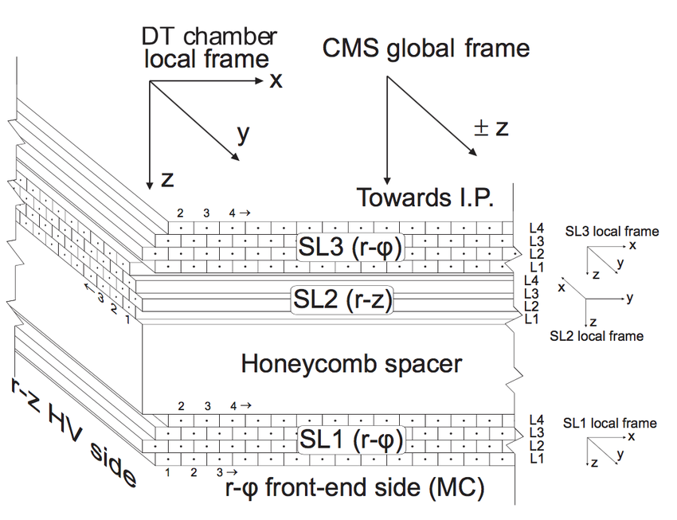

geometry
=========

This module provides tools to manage geometrical objects in the context of CMS DT detectors.

The CMS DTs geometry informatio is stored in a XML file - (:download:`DTGeometry.xml <../../_static/DTGeometry_v3.xml>`). 
The ``geometry`` module includes a class to read and manage this file (`DTGeometry`_).

By default, an instance of this class is created when this module (``geometry``) is imported, and the geometry information
can be accessed through the ``DTGEOMETRY`` global variable.

Additionally, this module offers a base class for defining geometrical objects representing various
DT chamber components (e.g., :doc:`./drift_cell`, DT :doc:`./layer`, DT :doc:`./super_layer`). This base class represents a general 
cubic form with properties such as bounds, center, id, width, height, etc. In this way, CMS DT chambers are built by nesting instances
of `DTFrame`_ class (see the `geometry-submodules`_ below). In other words, a Chamber is a DTFrame child
which contains SuperLayers; SuperLayers are DTFrame children that contain Layers; Layers are DTFrame
children that contain DriftCells.

The following image shows the composition of a CMS DT chamber and indicates how the reference frames 
for each component are defined. Transformations between these frames are possible with the help of the
``TranforManager`` class (see `Transforms`_ below).

.. toctree::
    :maxdepth: 1
    :caption: Submodules
    :name: geometry-submodules

    station
    super_layer
    layer
    drift_cell

.. warning::
    Starting from version 1.1.0, the XML geometry file includes the local and global positions of each Drift Cell. 
    Consequently, the :doc:`./layer` module was updated to directly read these properties from the file in the cells creation. 
    While this enhancement simplifies data access, it increases the creation time of a :doc:`./station` 
    object. To mitigate this when several stations are created, parallelization of the process is strongly recommended.

Classes
-------
- :ref:`DTGeometry`
- :ref:`DTFrame`

.. _DTGeometry:

DTGeometry
**********

.. autoclass:: mpldts.geometry.DTGeometry
    :members: get

The following example shows how to access the CMS DT geometry information.

.. literalinclude:: ../../../mpldts/geometry/_geometry.py
    :language: python
    :dedent:
    :lines: 113-134

.. rubric:: Output

.. code-block:: text

    Bounds for Wh:-1, Sec:1, St:4: (416.339996, 32.5999985, 251.100006)
    Global position for Wh:-2, Sec:1, St:1: (431.175, 39.12, -533.35)
    Local position for Wh:1, Sec:1, St:4: (720.2, -94.895, -267.75)
    Layer {'rawId': '574923776', 'layerNumber': '1'}
    Layer {'rawId': '574923776', 'layerNumber': '1'}
    Super_Layer {'rawId': '574922752', 'superLayerNumber': '1'}

.. note::
    Notice that the root attribute of the DTGeometry class is simply an instance of the `xml.etree.ElementTree <https://docs.python.org/3/library/xml.etree.elementtree.html>`_
    class, so you can use all its methods to navigate through the XML file. The only advantage of using
    DTGeometry is that it provides a more intuitive way to access the specific information of the CMS DT
    geometry through the ``get`` method.

.. tip::
    Instead of creating an instance of DTGeometry each time, if you will use the default geometry file,
    you can access the geometry information from the variable ``DTGEOMETRY``.

.. _DTFrame:

DTFrame
*******

.. autoclass:: mpldts.geometry.DTFrame
    :member-order: bysource
    :members:
    :special-members: __init__

Other utils
-----------
- :ref:`Transforms`

.. _Transforms:

Transforms
***********
The ``transforms`` module provides utility functions for computing geometrical properties, such as the 
pseudo-rapidity of a point given its global position. Most importantly, it includes the 
``TransformManager`` class, which is instantiated by each DT component to handle transformations 
between local, parent, and global reference frames.

.. automodule:: mpldts.geometry.transforms
    :members:
    :special-members: __init__

.. note::
    This documentation supports multiple versions. Use the version selector in the top-right corner to switch between versions.
