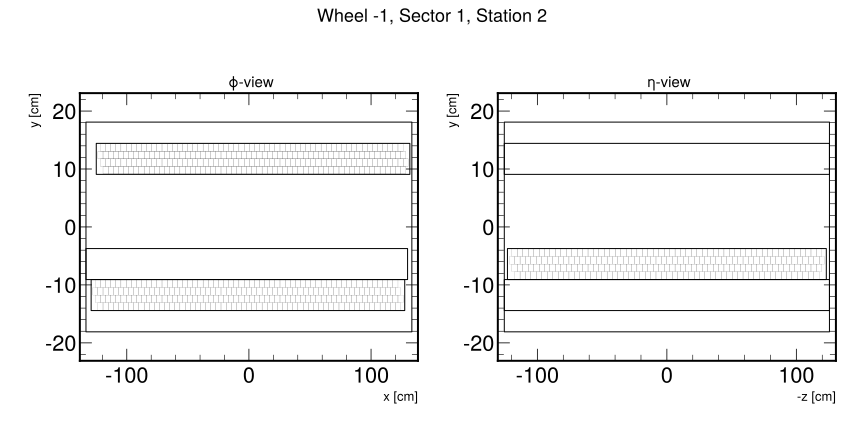
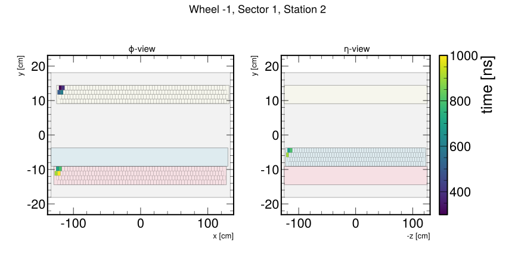

DTPatch
=======
The ``DTPatch`` class provides visualization capabilities for DT Station data. It can draw super layer
boundary boxes and DT cells, and allows for the definition of colormap cell colors based on time information (Or any other information that you label as "time" when pass it. XD).
The class supports plotting in both local and global CMS coordinate views using CMS geometry information.
In local mode, it is possible to draw the chamber in either the :math:`\phi` or :math:`\eta` orientation, displaying
the cells of SL1 and SL3 or the cells of SL2, respectively.

``DTPatch`` requires the prior definition of an instance of ``mpldts.geometry.station.Station``, which contains 
the geometrical information of the entire DT chambers.

The ``DTPatch`` class adds two collections to the provided matplotlib axes:

- ``bounds_collections``: A collection of patches representing the bounds of the station and its superlayers.
- ``cells_collection``: A collection of patches representing each DT cell, with optional colormap based on time information.

These collections can be accessed as attributes of the ``DTPatch`` instance.

.. tip::

    ``bounds_collections`` has the matplotlib property ``set_picker`` enabled, and the ``Station`` instance stored as the ``station`` attribute.
    This allows for the creation of interactive plots with the matplotlib ``pick_event``. 

.. rubric:: Examples

The following example shows how to create ``DTPatch`` objects and plot the cells of a DT chamber in the local view.

.. code-block:: python

    from mpldts.geometry.station import Station
    from mpldts.patches.dt_patch import DTPatch
    import matplotlib.pyplot as plt
    from mplhep import style
    from matplotlib.colors import Normalize

    plt.style.use(style.CMS)
    cmap = plt.get_cmap("viridis").copy()
    cmap.set_under("none")
    norm = Normalize(vmin=299, vmax=1000, clip=False)

    fig, axs = plt.subplots(1, 2, figsize=(12, 6))
    axs = axs.flatten()

    chamber = Station(wheel=-1, station=2, sector=1)
    dt_patch_phi = DTPatch(chamber, axs[0], local=True, faceview="phi", cells_kwargs={"cmap": cmap, "norm": norm, "edgecolor": "k", "linewidth": .1})
    dt_patch_eta = DTPatch(chamber, axs[1], local=True, faceview="eta", cells_kwargs={"cmap": cmap, "norm": norm, "edgecolor": "k", "linewidth": .1}) 

    width, height, length = chamber.bounds
    x, y, z = chamber.local_center

    fig.suptitle(chamber.name, fontsize=18)
    axs[0].set_xlim(x - width/2 - 5, x + width/2 + 5)
    axs[0].set_ylim(y - height/2 - 5, y + height/2 + 5)

    axs[0].set_title(r' $\phi$-view', fontsize=15)
    axs[0].set_xlabel('x [cm]', fontsize=13)
    axs[0].set_ylabel('y [cm]', fontsize=13)
    
    axs[1].set_xlim(z - length/2 - 5, z + length/2 + 5)
    axs[1].set_ylim(y - height/2 - 5, y + height/2 + 5)
    axs[1].set_title(r' $\eta$-view', fontsize=15)
    axs[1].set_xlabel('-z [cm]', fontsize=13)
    axs[1].set_ylabel('y [cm]', fontsize=13)
    
    plt.tight_layout()
    plt.show()

Other matplotlib kwargs are accepted, and a colormap based on time information can be defined:

.. code-block:: python

    # changing the chamber definition to...
    chamber = Station(
        wheel=-1, station=2, sector=1,
        dt_info=[
            {"sl": 1, "l": 1, "w": 1, "time": 300},
            {"sl": 1, "l": 1, "w": 2, "time": 400},
            {"sl": 1, "l": 2, "w": 1, "time": 500},
            {"sl": 1, "l": 2, "w": 2, "time": 600},
            {"sl": 2, "l": 1, "w": 1, "time": 700},
            {"sl": 2, "l": 1, "w": 2, "time": 800},
            {"sl": 2, "l": 2, "w": 1, "time": 900},
            {"sl": 3, "l": 1, "w": 1, "time": 700},
            {"sl": 3, "l": 1, "w": 2, "time": 800},
            {"sl": 3, "l": 2, "w": 1, "time": 900},
            {"sl": 3, "l": 2, "w": 2, "time": 1000},
        ],
    )
    # defining more kargs...
    bounds_kwargs = {
        "facecolor": ["lightgray", "lightyellow", "lightpink", "lightblue"],
        "edgecolor": "k", 
        "linewidth": 1, 
        "alpha": 0.3
    }
    cells_kwargs = {
        "cmap": cmap,
        "norm": norm,
        "edgecolor": "k",
        "linewidth": .1
    }
    dt_patch_phi = DTPatch(chamber, axs[0], local=True, faceview="phi", cells_kwargs=cells_kwargs, bounds_kwargs=bounds_kwargs)
    dt_patch_eta = DTPatch(chamber, axs[1], local=True, faceview="eta", cells_kwargs=cells_kwargs, bounds_kwargs=bounds_kwargs) 
    # and adding the colorbar...
    fig.colorbar(dt_patch_eta.cells_collection, label="time [ns]")

Since each ``DTPatch`` object is an isolated instance, it is possible to plot multiple chambers in the same axes and use the global mode
to utilize the exact CMS coordinate system to visualize part or the whole DT system.

.. code-block:: python

    fig, ax = plt.subplots(dpi=800)
    bounds_kwargs = {
        "facecolor": ["lightgray", "lightyellow", "lightpink", "lightblue"],
        "edgecolor": "k", 
        "linewidth": 72 / fig.dpi, 
        "alpha": 0.3
    }
    cells_kwargs = {
        "cmap": cmap,
        "norm": norm,
        "edgecolor": "k",
        "linewidth": .1 * 72 / fig.dpi,
    }
    for sec in range(1, 15):
        for st in range(1, 5):
            try:
                chamber = Station(wheel=-2, station=st, sector=sec)
                _ = DTPatch(chamber, ax, local=False, faceview="phi", bounds_kwargs=bounds_kwargs, cells_kwargs=cells_kwargs)
            except:
                continue

    ax.set_xlim(-800, 800)
    ax.set_ylim(-800, 800)
    ax.set_title('Global view', fontsize=18)
    ax.set_xlabel('x [cm]', fontsize=15)
    ax.set_ylabel('y [cm]', fontsize=15)
    plt.tight_layout()
    plt.show()

.. image:: ../../_static/img/dt_patch_global_color.svg
    :alt: Alternative text
    :class: image-class
    :width: 600px
    :align: center

.. autoclass:: mpldts.patches.dt_patch.DTPatch
    :members:
    :undoc-members: __dict__, __module__, __weakref__
    :special-members: __init__