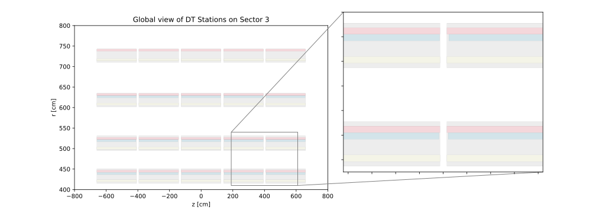
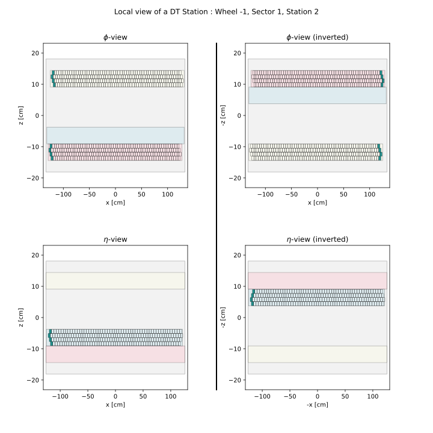

DTPatch
=======

The ``DTPatch`` class provides visualization capabilities for DT Station data. It can draw station and super layer
boundary boxes, and DT cells based on geometrical information taken from :doc:`Station <../geometry/station>` instances.

The class itself is not a matplotlib artist, but it creates a couple of matplotlib patch collections 
to draw the station bounds and cells and that can be accessed as attributes of the ``DTPatch`` instance. 
It adds to the provided matplotlib axes the following artists:

- ``bounds_collections``: A collection of patches representing the bounds of the station and its superlayers.
- ``cells_collection``: A collection of patches representing each DT cell, with optional colormap based on time information.

Since station and super layers bounds are a patch collection independent of the cells collection, any supported matplotlib
rc parameters can be passed to customize the appearance of the bounds. The same applies to the cells collection, specially
the patch array that allows to define the color map to represent any drift cell properties passed through
the ``dt_info`` argument of the ``Station`` class.

The class supports plotting in both **local** and **global** DT CMS coordinate views. In local mode,
it is possible to draw the chamber in either the :math:`\phi` or :math:`\eta` orientation, displaying
the cells of ``SL1`` and ``SL3`` or the cells of ``SL2``, respectively.

.. tip::

    ``bounds_collections`` has the matplotlib property ``set_picker`` enabled, and the ``Station`` 
    instance stored as the ``station`` attribute. This allows for the creation of interactive plots
    with the matplotlib ``pick_event``. 

.. autoclass:: mpldts.patches.dt_patch.DTPatch
    :members:
    :undoc-members: __dict__, __module__, __weakref__
    :special-members: __init__

Examples
--------

The following example shows how to create ``DTPatch`` objects and plot the cells of a DT chamber in the local view.

.. literalinclude:: ../../../test/cms_dt_local_wb.py
    :language: python
    :lines: 1-48
    :linenos:

Setting the ``bounds_kwargs`` and ``cells_kwargs`` arguments allows for customization of the
appearance of the bounds and cells, respectively. And as mentioned before, the ``dt_info`` argument
passed to the ``Station`` instance can be used to define a colormap based on any drift cell property as 
shown in the following example.

.. literalinclude:: ../../../test/cms_dt_local_c.py
    :language: python
    :lines: 1-85
    :emphasize-lines: 4, 9-11, 17-18, 21-44, 51, 56, 60, 64 
    :linenos:

Since each ``DTPatch`` object is an isolated instance, it is possible to plot multiple chambers in 
the same axes and use the global mode to utilize the exact CMS coordinate system to visualize part 
or the whole DT system.

.. literalinclude:: ../../../test/cms_dts_phi_zoomed.py
    :language: python
    :lines: 1-70
    :linenos:

.. image:: ../../_static/img/cms_dts_phi_zoomed.svg
    :alt: Alternative text
    :class: image-class
    :width: 1200px
    :align: center

And also in :math:`\eta` orientation, that means the longitudinal CMS view:

.. literalinclude:: ../../../test/cms_dts_eta_zoomed.py
    :language: python
    :lines: 1-68
    :linenos:
    

As you can notice from the first `example <cms_dt_local_wb>`_, the chamber appears in a local reference frame
resulting in an unnaturally rotated view. ``DTPatch`` provides a direct way to invert the view
by calling ``invertStation`` method (or setting the ``invert`` argument ``True`` when instantiating). 
This simply applies a reflection in the x-axis if the plot is in :math:`\phi` orientation
or in the x-axis and y-axis if the plot is in :math:`\eta` orientation as shown in the following ilustration.

.. image:: ../../_static/img/mpldts_view_frames.png 
    :alt: Alternative text
    :class: image-class
    :width: 800px
    :align: center

.. literalinclude:: ../../../test/cms_dt_local_inversion.py
    :language: python
    :lines: 1-87
    :linenos:

